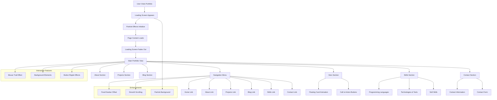

# Portfolio Architecture Diagram

## Component Descriptions

### Loading Screen

- Appears immediately when user visits the site
- Features particle effects in the background
- Displays a branded loading spinner
- Automatically fades out when page content loads

### Navigation System

- Fixed position navbar for easy access
- Smooth scrolling to sections
- Offset calculation to account for navbar height
- Mobile-responsive hamburger menu

### Interactive Elements

- Mouse trail effect that follows cursor
- Background elements with pulsing animations
- Button ripple effects on click
- Hover animations on cards and buttons

### Skills Section Enhancement

- Addition of Adobe Photoshop to the skills list
- Consistent styling with existing skills items
- Proper icon integration using Font Awesome

### Performance Considerations

- Particle effects optimized for performance
- CSS transitions instead of JavaScript where possible
- Lazy loading for images
- Efficient event handling
